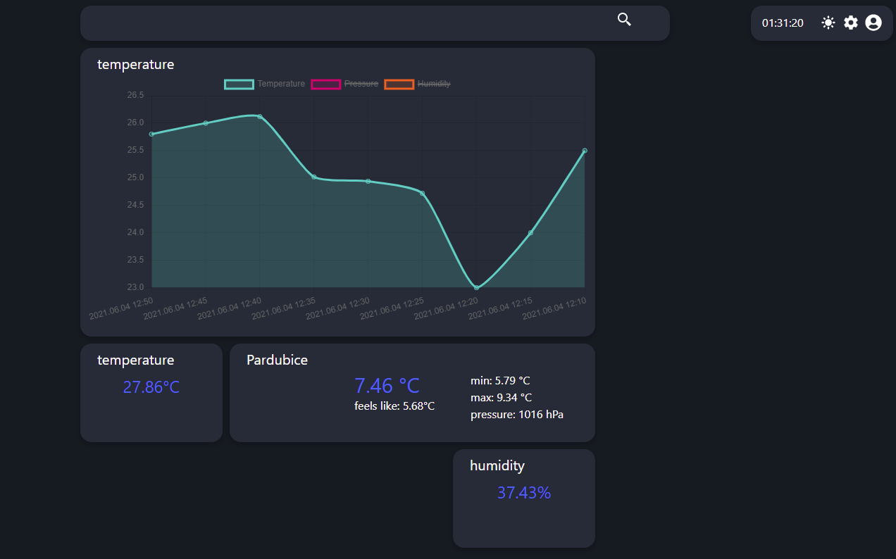

# czus home

## compatible sensors:

[esp8266 + BME280 / BMP280](https://github.com/krystofex/czus-home-esp8266)\
[esp32cam](https://github.com/krystofex/esp32cam-mjpeg-stream)

## installation:

```shell
git clone https://github.com/krystofex/czus-home
cd czus-home
mv .\.env.local.example .\.env.local
yarn install
yarn build
yarn start
```

## about:

Czus home is my school and also free time project. It is web app, which helps you control and monitor your smart home. It ain't much, but it's honest work.

## screenshot from app:


